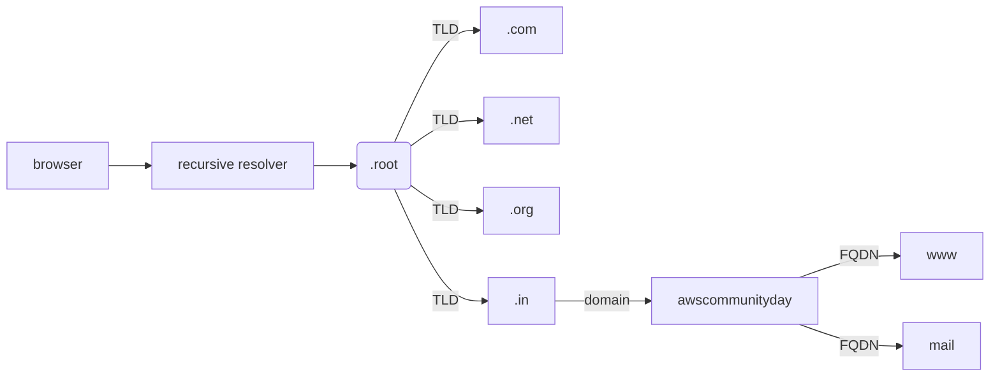
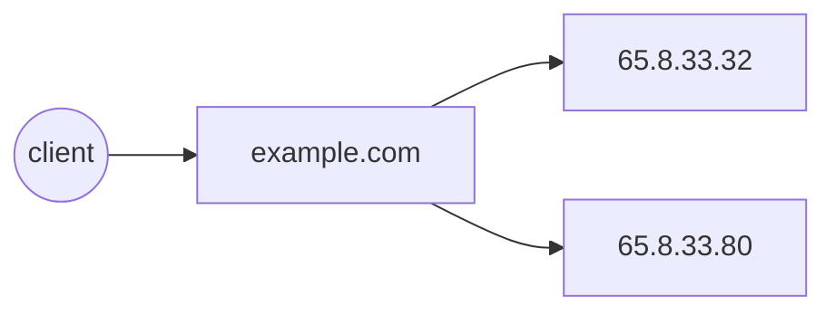
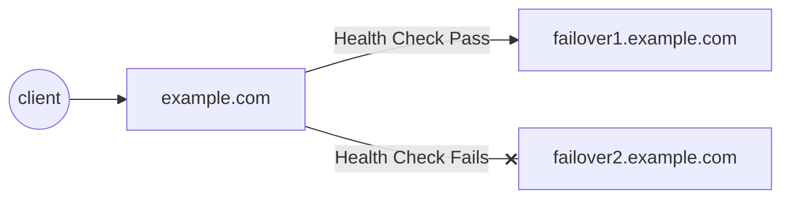
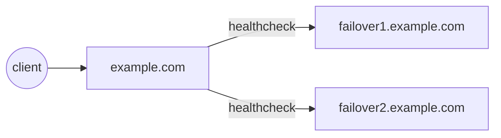
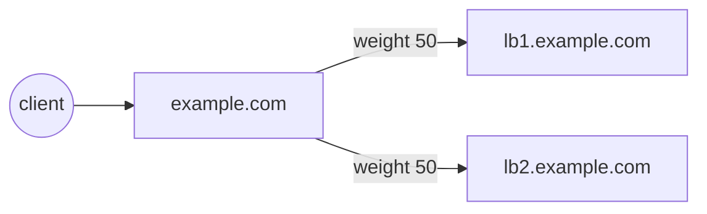
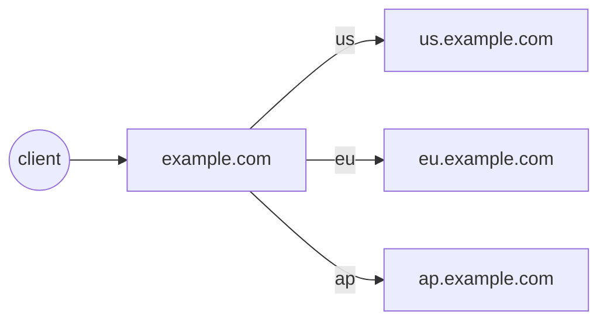
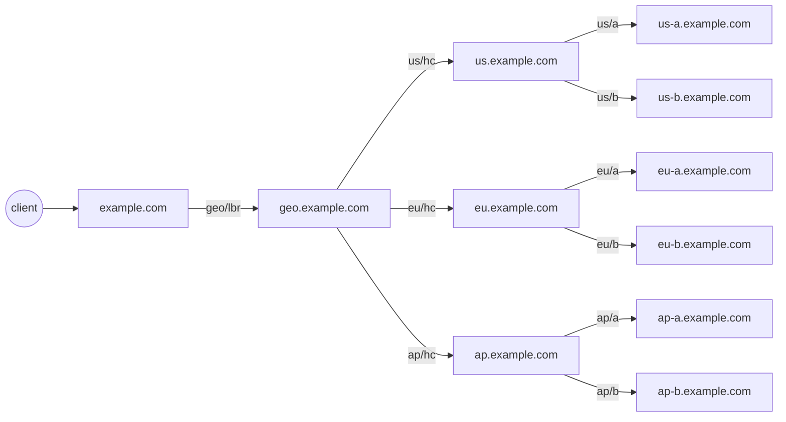

# Enabling automated multi-region failover and failback using Route 53

---

# Agenda

- What's DNS?
- Deep dive into Route 53 Records & Health Check
- What's a good candidate for multi-region?
- Applying automated failover
- Hints, tips

<!-- 

* Welcome to my talk about DNS and Route 53. 
* I'm Sathyajith Bhat, a Staff SRE at The Trade Desk and an AWS Container Hero
* This is what we have lined up for the talk.

-->

---

# Some notes

- Drop your questions as chat
- Slides at https://slides.sathyasays.com/

<!-- 

Some housekeeping rules:

* If you have any questions, leave them in chat, will pick it up later
* Slides are on my website, which has link to the source code as well

-->

---

# What's DNS?

<v-clicks>

- [What happens when you](https://github.com/alex/what-happens-when) type awscommunityday.in?
- Domain Name System - "phonebook of the internet"
  - _does anyone *remember* what phonebooks are?_
- Maps host names to IP addresses for services to look up
- DNS resolution involves clients, resolvers, and servers.

</v-clicks>

<!--

* let's start - 
* Have you ever wondered what happens when you type in a website address? 
  * How do you get connected to the website?
  * Leave a comment if you know

* There's a nice github page that talks about this, and while I don't want to focus on the details, I want to point out
about name resolution. Ie, how a domain name gets mapped to an IP address
* That is done by DNS.
* DNS is called the "phonebook of the internet"
* DNS resolution involves clients, resolvers, and servers.
* I'll give a brief on steps involved in resolution, but first lets look at DNS servers, resolvers and what they mean 

1. gethostbyname
-->

---

# Types of servers

<v-clicks>

- Recursive resolver - acts as a middleman between client & nameserver.
- Root nameserver - First step of hostname resolution and serves as a reference to another locations
  - fun fact: there are only 13 root name servers! Do you know which ones they are?
- TLD Nameserver - Next step of host resolution and holds the TLD records (.com etc)
- Authoritative server - holds the actual IP address of the requested domain

</v-clicks>

<!--

* Let's look at the type of servers involved in DNS resolution. First is the recurisve resolver.
* The recursive resolver contacts the root nameserver, which is the first stop for a recursive resolver.
* Once it gets a response from a root nameserver, it get talks to the TLD nameserver, and then authoritive.
* every resolvers knows the root servers, and there are 13 of them
`{a-m}.root-servers.net`
* Once the resolver gets the TLD nameserver address, the request is then forwarded to the TLD
* The TLD nameserver holds TLD record (for .com is a TLD), and responds with IP of the authoritative server, which holds the IP address for the requested domain

* 
-->

---

# DNS Terminology

<v-clicks>

- Zone file
  - File containing mapping of different domain names to IP addresses
- Records
  - Mapping of a a domain to an IP address
- TTL
  - How long a result is cached

</v-clicks>

---

# Querying DNS Records

```bash

dig awscommunity.in

; <<>> DiG awscommunity.in


;; OPT PSEUDOSECTION:
; EDNS: version: 0, flags:; udp: 65494
;; QUESTION SECTION:
;awscommunity.in.               IN      A

;; ANSWER SECTION:
awscommunity.in.        279     IN      A       15.197.142.173
awscommunity.in.        279     IN      A       3.33.152.147

```

Something short?

```bash

dig +short TXT whois.aws.sathyabh.at

"Sathyajith is a Staff SRE currently working at the Trade Desk"
```
<!--

Let's look at how you can query for DNS records. 
the most common tool is dig (Domain Information Groper)
* using dig, you can pull up the records, 
* if you don't specify the record type, it fetches the A records

-->

---

# Hierarchy



---

# What's Route 53

<v-clicks>

- AWS' Managed DNS service
  - fun fact: name comes from port 53 that is used for DNS traffic
  - Advanced routing capabilities of Route 53
- Route 53 lets you:
  - simple boring stuff: register and manage DNS records
  - private & public hosted zones
  - Advanced routing (Latency/Geo/IP based routing)

</v-clicks>

---

# Route 53 record types - Standard

<v-clicks>

- Standard
- Failover
- Weighted
- Geolocation
- Latency based
- IP-based
- Multivalue

</v-clicks>

<!-- 
* remember, this is not to be confused with DNS record types
-->

---

# Route 53 record types - Standard

<v-clicks>

- Simple Routing

  - Standard DNS record with no additional Route 53 routing/features



</v-clicks>

<!--

* you can have the same record with different IPs
-->

---

# Route 53 record types - Failover

<v-clicks>

- Failover Routing - Active/Passive

- DNS with two records (or more) associated
  - Primary (with healthcheck)
  - Secondary (with optional healthcheck)
- When healthcheck of primary fails, Route 53 shifts to secondary

</v-clicks>

<v-clicks>



</v-clicks>

---

# Route 53 record types - Failover

<v-clicks>

- Failover Routing - Active/Active

- DNS record with two or more records associated
  - Primary (with healthcheck)
  - Secondary (with healthcheck)
- When healthcheck of primary fails, Route 53 shifts to secondary, vice versa

</v-clicks>

<v-clicks>



</v-clicks>

<!--


-->

---

# Route 53 record types - Weighted

<v-clicks>

- Multiple records associated with a domain
  - Each record has a weight associated
  - Traffic distribution is based on relative weight - (weight/sum)
- Add health checks to skip unhealthy targets!

</v-clicks>

<v-clicks>



</v-clicks>

<!--

* weighted records can be used for traffic shifting, a/b deploys etc
* note that weights can be any numbers
  * 0 - 100 gives an easy % mapping

-->

---

# Route 53 record types - Geolocation

<v-clicks>

- Multiple records associated with a domain
- Each record is associated with a Geographic location
  - A default location needs to be provided if location is not available
  - Traffic distribution is based on user of the Geo
  - Geo targeting can be traffic from continents or countries
- Add health checks to skip unhealthy targets!

</v-clicks>

<v-clicks>



</v-clicks>

<!--

* AWS uses EDNS0 to estimate the location
* ENDS0 adds several extensions, one of them [edns-client-subnet](https://tools.ietf.org/html/draft-ietf-dnsop-edns-client-subnet-08)
* If browser or any client doesn't edns-client-subnet, R53 falls back IP determination using truncated IP of the user
-->

---

# Route 53 record types - Latency

<v-clicks>

- Multiple records associated with a domain
- Each record is associated with a specific region
  - Traffic distribution is on the lowest latency (as calculated by AWS)
- Add health checks to skip unhealthy targets!
- Drawbacks:
  - Can tend to be not accurate

</v-clicks>

<v-clicks>


</v-clicks>

<!--

* AWS uses EDNS0 to estimate the location
* ENDS0 adds several extensions, one of them [edns-client-subnet](https://tools.ietf.org/html/draft-ietf-dnsop-edns-client-subnet-08)
* If browser or any client doesn't edns-client-subnet, R53 falls back IP determination using truncated IP of the user
* Latency is calculated based AWS' latency data

* We've seen cases where latency data was wrong on AWS, and request from CA was being sent to Japan, instead of us-west-2
* _A request that is routed to the Oregon region this week might be routed to the Singapore region next week._
-->

---

# Route 53 record types - IP-based, Multi-value
<v-clicks>

IP Based

- Lets us upload user IP to endpoint mapping
- Associate CIDR to a record set.

Multivalue

- Returns multiple values such as IP addresses to a record.
- Health chekcks can filter out unhealthy endpoints.

</v-clicks>

<!--

* AWS uses EDNS0 to estimate the location
* ENDS0 adds several extensions, one of them [edns-client-subnet](https://tools.ietf.org/html/draft-ietf-dnsop-edns-client-subnet-08)
* If browser or any client doesn't edns-client-subnet, R53 falls back IP determination using truncated IP of the user

-->

---

# Route 53 Health Checks

<v-clicks>

- Route 53 monitors health of resource
- Types of Route 53 health checks:
  - Monitor an endpoint
  - Monitor CloudWatch alarms
  - Calculated health checks

</v-clicks>

---

# Route 53 Health Checks - Monitoring Endpoints

<v-clicks>

- Monitor for specific endpoints by

  - protocol (HTTP/HTTPS/TCP)
  - Domain name
  - IP
  - path

</v-clicks>

<!--

Route 53 uses different methods:

* if you specify HTTP, it establishes a TCP connect, makes a HTTP request and waits for a 2xx/3xx status code.
* if you specify HTTPS, it establishes a TCP connect, makes a HTTPS request and & waits for a 2xx/3xx status code.
* if you specify TCP, it establishes a TCP connection

-->

---

# Route 53 Health Checks - Monitoring Endpoints - Advanced Properties

- Endpoint monitoring can have advanced config options:

  - Time between health checks
  - string matching
  - Failure thresholds
  - Inverted health checks
  - Customizable regions

---

# What apps are good candidate for multi-region?

<v-clicks>

- Depends on how you architect them and how you do multi-region
- Active-Active?
  - Stateless services
  - Services with data stores:
    - Global backing stores
    - Regional data store w/ replication

</v-clicks>

---

# What apps are good candidate for multi-region?

<v-clicks>

- Active-Passive?
  - Active compute in the active region
  - Cold/warm data store with ready to cut over
  - Another approach: multi-region, multi-master aware data stores

</v-clicks>

---

# How would the records look like?



---

# Hints, tips

<v-clicks>

- Understand your application architecture before jumping in
- Irony: Route 53 is available only in us-east-1
- (Ab)use your health checks for reliability:
  - having issues in specific AZ but not enough to trigger a failover? Fail the healthcheck
- Have aws-cli commands for creating records handy!
  - CLI retries but not the console

</v-clicks>
---

# Q&A, Links

- [GitHub repo (slides + code)](https://github.com/SathyaBhat/talks-slides)
- Catch me on [Twitter](https://twitter.com/sathyabhat), [GitHub](https://github.com/sathyabhat), [LinkedIn](https://www.linkedin.com/in/sathyabhat/) - sathyabhat

---
src: ../../about.md
---
