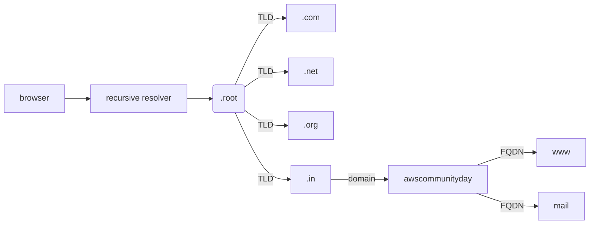
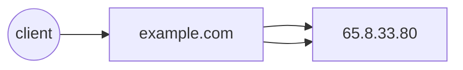
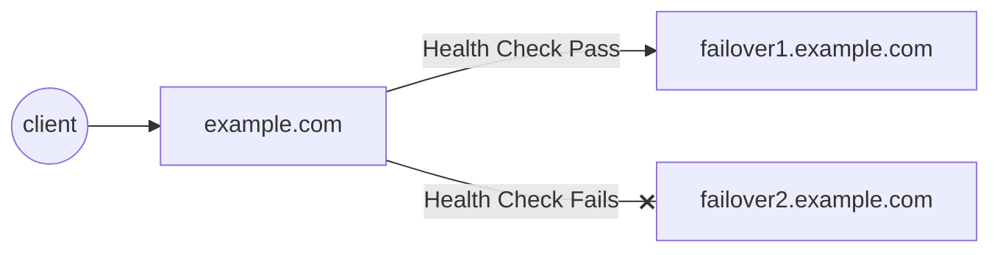
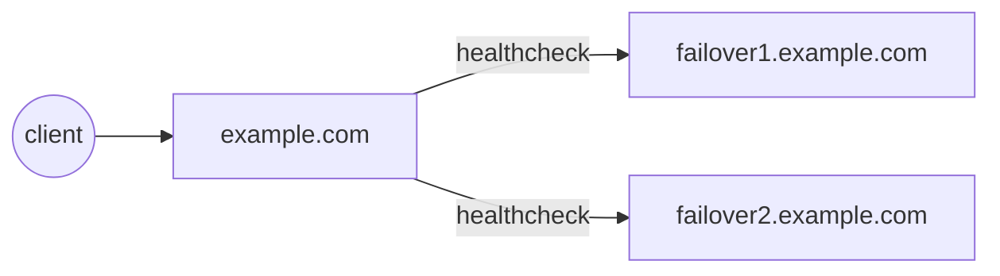
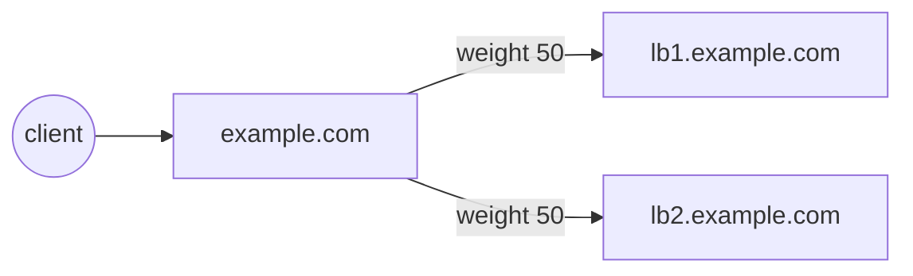
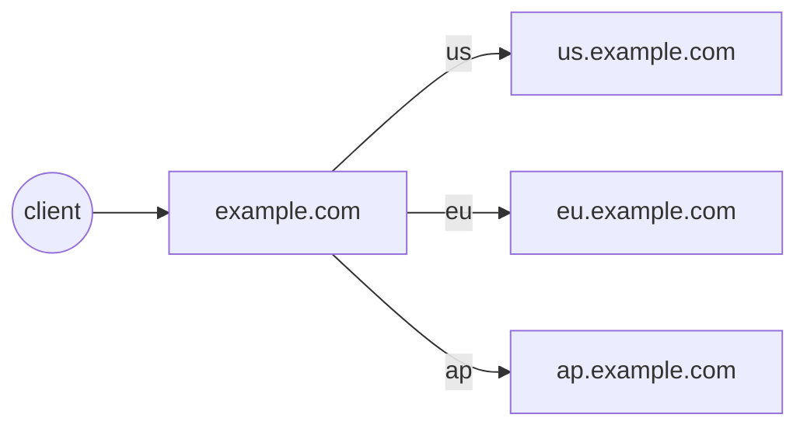

# Enabling automated multi-region failover and failback using Route 53

---

# Agenda

- What's DNS?
- Deep dive into Route 53
- What's a good candidate for multi-region?
- Applying automated failover
- Hints, tips
- About me

<!--

todo: add about route 53 mapper, (ab)using health checks to force traffic, don't be afraid of the CLI & more
-->

---

# Some notes

- Feel free to stop me at any time!
- Slides on GitHub

---

# What's DNS?

<v-clicks>

- [What happens when you](https://github.com/alex/what-happens-when) type awscommunityday.in?
- Domain Name System - "phonebook of the internet"
  - _does anyone *remember* what phonebooks are?_
- Maps host names to IP addresses for services to look up
- DNS Servers and clients

</v-clicks>

<!--

* Have you ever wondered what happens when you type in a website address?
  * How does it get connected to the website?

* There's a nice github page that talks about this, and while I don't want to focus on the details, I want to point out
about name resolution. Ie, how a domain name gets mapped to an IP address
* That is done by DNS.
talk about how DNS resolution works

1. gethostbyname
-->

---

# Types of servers

<v-clicks>

- Recursive resolver - acts as a middleman between client & naemserver.
- Root nameserver - First step of hostname resolution and serves as a reference to another locations
  - fun fact: there are only 13 root name servers! Do you know which ones they are?
- TLD Nameserver - Next step of host resolution and holds the TLD records
- Authoritative server - holds the actual IP address

</v-clicks>

<!--

* The recursive resolver contacts the root nameserver, which is the first stop for a recursive resolver.
* Once it gets a response from a root nameserver, it get talks to the TLD nameserver, and then authoritive.
`{a-m}.root-servers.net`

-->

---

# DNS Terminology

<v-clicks>

- Zone file
  - File containing mapping of different domain names to IP addresses
- Records
  - Mapping of a a domain to an IP address
- TTL
  - How long a result is cached

</v-clicks>

---

# Querying DNS Records

```bash

dig awscommunity.in

; <<>> DiG awscommunity.in


;; OPT PSEUDOSECTION:
; EDNS: version: 0, flags:; udp: 65494
;; QUESTION SECTION:
;awscommunity.in.               IN      A

;; ANSWER SECTION:
awscommunity.in.        279     IN      A       15.197.142.173
awscommunity.in.        279     IN      A       3.33.152.147

```

Something short?

```bash

dig +short TXT whois.aws.sathyabh.at

"Sathyajith is a Staff SRE currently working at the Trade Desk"
```

---

# Hierarchy



---

# What's Route 53

<v-clicks>

- AWS' Managed DNS service
  - fun fact: name comes from port 53 that is used for DNS traffic
  - Advanced routing capabilities of Route 53
- Route 53 lets you:
  - simple boring stuff: register and manage DNS records
  - private & public hosted zones
  - Advanced routing (Latency/Geo/IP based routing)

</v-clicks>

---

# Route 53 record types - Standard

<v-clicks>

- Standard
- Failover
- Weighted
- Geolocation
- Latency based
- IP-based
- Multivalue

</v-clicks>

# Route 53 record types - Standard

<v-clicks>

- Simple Routing

  - Standard DNS record with no addition Route 53 routing/features



</v-clicks>

<!--

* remember, this is not to be confused with DNS record types
* can you same record with different IPs
-->

---

# Route 53 record types - Failover

<v-clicks>

- Failover Routing - Active/Passive

- DNS with two records (or more) associated
  - Primary (with healthcheck)
  - Secondary (with optional healthcheck)
- When healthcheck of primary fails, Route 53 shifts to secondary

</v-clicks>

<v-clicks>



</v-clicks>

---

# Route 53 record types - Failover

<v-clicks>

- Failover Routing - Active/Active

- DNS record with two or more records associated
  - Primary (with healthcheck)
  - Secondary (with healthcheck)
- When healthcheck of primary fails, Route 53 shifts to secondary, vice versa

</v-clicks>

<v-clicks>



</v-clicks>

<!--

* remember, this is not to be confused with DNS record types
* can you same record with different IPs
-->

---

# Route 53 record types - Weighted

<v-clicks>

- Multiple records associated with a domain
  - Each record has a weight associated
  - Traffic distribution is based on relative weight - (weight/sum)
- Add health checks to skip unhealthy targets!

</v-clicks>

<v-clicks>



</v-clicks>

<!--

* note that weights can be any numbers
  * 0 - 100 gives an easy % mapping

-->

---

# Route 53 record types - Geolocation

<v-clicks>

- Multiple records associated with a domain
- Each record is associated with a Geographic location
  - Traffic distribution is based on user of the Geo
  - Geo targeting can be traffic from continents or countries
- Add health checks to skip unhealthy targets!

</v-clicks>

<v-clicks>



</v-clicks>

<!--

* AWS uses EDNS0 to estimate the location
* ENDS0 adds several extensions, one of them [edns-client-subnet](https://tools.ietf.org/html/draft-ietf-dnsop-edns-client-subnet-08)
* If browser or any client doesn't edns-client-subnet, R53 falls back IP determination using truncated IP of the user
-->

---

# Route 53 record types - Latency

<v-clicks>

- Multiple records associated with a domain
- Each record is associated with a specific region
  - Traffic distribution is on the lowest latency (as calculated by AWS)
- Add health checks to skip unhealthy targets!
- Drawbacks:
  - Can tend to be not accurate

</v-clicks>

<v-clicks>


</v-clicks>

<!--

* AWS uses EDNS0 to estimate the location
* ENDS0 adds several extensions, one of them [edns-client-subnet](https://tools.ietf.org/html/draft-ietf-dnsop-edns-client-subnet-08)
* If browser or any client doesn't edns-client-subnet, R53 falls back IP determination using truncated IP of the user
* Latency is calculated based AWS' latency data

* We've seen cases where latency data was wrong on AWS, and request from CA was being sent to Japan, instead of us-west-2
* _A request that is routed to the Oregon region this week might be routed to the Singapore region next week._
-->

---

# Route 53 record types - IP-based, Multi-vbalue

<v-clicks>

IP Based

- Lets us upload user IP to endpoint mapping
- Associate CIDR to a record set.

Multivalue

- Returns multiple values such as IP addresses to a record.
- Health chekcks can filter out unhealthy endpoints.

</v-clicks>

<!--

* AWS uses EDNS0 to estimate the location
* ENDS0 adds several extensions, one of them [edns-client-subnet](https://tools.ietf.org/html/draft-ietf-dnsop-edns-client-subnet-08)
* If browser or any client doesn't edns-client-subnet, R53 falls back IP determination using truncated IP of the user
* Latency is calculated based AWS' latency data

* We've seen cases where latency data was wrong on AWS, and request from CA was being sent to Japan, instead of us-west-2
* _A request that is routed to the Oregon region this week might be routed to the Singapore region next week._
-->

---

# Deepdive into Route 53 Health Checks

<v-clicks>

</v-clicks>

---

# Multi-AZ v/s Multi-Region

---

# What's a good candidate for multi-region?

---

# Applying automated failover

---

# Hints, tips

---

# Q&A, Links

- [GitHub repo (slides + code)](https://github.com/SathyaBhat/talks-slides)
- Catch me on [Twitter](https://twitter.com/sathyabhat), [GitHub](https://github.com/sathyabhat), [LinkedIn](https://www.linkedin.com/in/sathyabhat/) - sathyabhat

---

## src: ../../about.md

```

```
