# AWS Networking

---

# Agenda

- Cloud Networking basic constructs
  - Network definition
    - VPC, Subnets, Route tables
  - Network security
    - Network ACLs, Security Groups
  - Network connectivity (egress)
    - NAT Gateways, Internet Gateways
  - Network connectivity (cross-talk)
    - VPC Peering, Transit Gateways, Direct Connect, VPC Endpoints
  - Demos

<!-- 

* Welcome to my talk about AWS Networking
* I'm Sathyajith Bhat, a Staff SRE at The Trade Desk and an AWS Container Hero
* This is what we have lined up for the talk.
* We'll start with talking about some cloud networking constructs 
  * Including VPCs, subnets, and then we'll move to more advanced concepts from there
* Feel free to stop me at any point, if you have any questions.
* Nambi will drive some demos at a later point and I'll be around to answer your questions
-->

---
layout: two-cols
---

# VPC

* Virtual Private Cloud
* Launch resources in a isolated virtual network
* Create VPC by providing an IP range ("CIDR")
  * allowed block size is a /16 to a /28
  * [Visual Subnet calculator](https://www.davidc.net/sites/default/subnets/subnets.html) is a nice tool to visualize
* Create a IPv4 only or IPv4+IPv6 ("dual stack")
* Provide CIDR by self or from an IPAM pool

::right::

<!-- 

* CIDR: Classless Inter-Domain Routing

-->

---
layout: two-cols
--- 

# Subnet

* VPC broken down to smaller chunks called subnets
* Resources are placed in a subnet
* Each subnet must reside in an AZ and cannot cross zones
* Subnet address range:
  * IPv4 only
  * IPv6 only
  * Dual stack

::right::

<!--

-->

---

# Subnet Types

<v-clicks>

* Subnet type is determined by the route that associated with them, not name
  * Public
  * Private
  * VPN-only
  * Isolated

</v-clicks>

<!--

* Public subnet – The subnet has a direct route to an internet gateway. Resources in a public subnet can access the public internet.
* Private subnet – The subnet does not have a direct route to an internet gateway. Resources in a private subnet require a NAT device to access the public internet.
* VPN-only subnet – The subnet has a route to a Site-to-Site VPN connection through a virtual private gateway. The subnet does not have a route to an internet gateway.
* Isolated subnet – The subnet has no routes to destinations outside its VPC. Resources in an isolated subnet can only access or be accessed by other resources in the same VPC.
 
-->

---
layout: two-cols
---

# Routing

* So how do resources know where to send packets to?
* Route table controls routing
* Route table is associated with a subnet
* Create and assign different route tables to different subnets

::right::

---
layout: two-cols
---

# Network Security - Security Groups

* Control traffic that is allowed to reach/leave resources
* Security groups have rules associated with them
* Security groups are stateful

::right::

---
layout: two-cols
---

# Network ACL

* Control traffic that is allowed to reach/leave resources at subnet level
* Network ACLs are stateless
* Rules evaluated in order from lowerst numbered rule

::right::

<!--
Stateless means that responses to allowed inbound traffic are subject to the rules for outbound traffic (and vice versa).
-->

---

# Internet Gateway

* Connects the VPC with public internet
* Internet gateway supports IPv4 & v6
* Associated via a route in route table 

---

# NAT Gateway/Instance

* NAT gateway handles NAT (network address translation)
* Allows for device in private subnet to connect to internet
* NAT types:
  * NAT instance
  * NAT Gateway
    * Public NAT gateway
    * Private NAT gateway
* NAT Gateway is priced per hours + data processing charges

<!-- 
NAT stands for Network Address Translation. It is allow devices on a private network to communicate with devices on a public network, such as the internet.

* NAT works by translating source IP address of outgoing packets and modifies them to use public IP
* When it receives the packet, this translation is reversed

-->

---
layout: two-cols
---

# Default VPC

* AWS creates a default VPC in each region. It comes with
  * default subnet in each AZ
  * route table associated with each subnet
  * Internet Gateway 
  * public DNS hostnames and DNS resolution enabled

::right:: 

---

# Network Connectivity - Peering

* Peering allows two VPC to connect to each other
* Resources in peered VPC communicate as if on same network
* Peering can be done with same account, cross account, and cross region
* Peering is internal-only, traffic never exits to public internet
* Peering is not transitive

---
layout: two-cols
---
# VPC Peering 

* Resources in A can talk to B

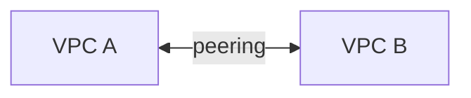

::right:: 

# VPC Peering 

* Resources in A can talk to B
* Resources in B can talk to C
* Resources in A **cannot** talk to C

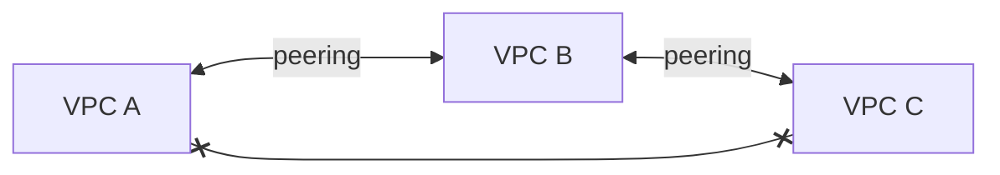

---

# Peering steps

* Requester sends request to accpeter
* Accepter VPC accepts the request
* Route tables are updated to route traffic to the peered request

---
layout: two-cols
---

# Transit Gateway

* Transit Gateway (TGW) connects VPCs and on-prem networks through a central hub
* Enables transitive connections 
* Transit gateway is priced per TGW attachment and data processed

::right::

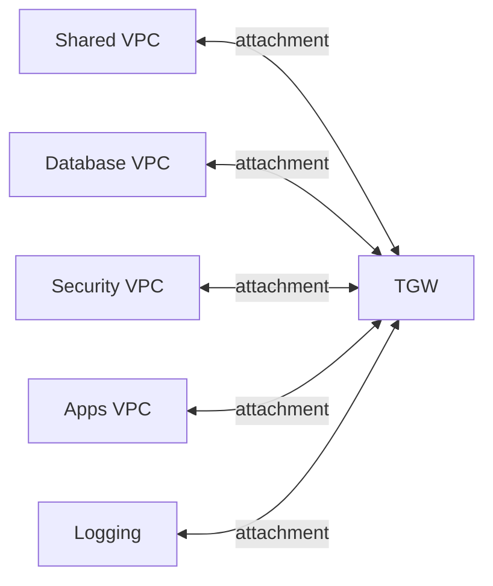

---
layout: two-cols
---

# Direct Connect

* Cloud service that sets up a dedicated connection between onprem and AWS
* Direct Connect provides a private network conection
  * Bypasses the Internet
* Enables Hybrid Cloud

::right::

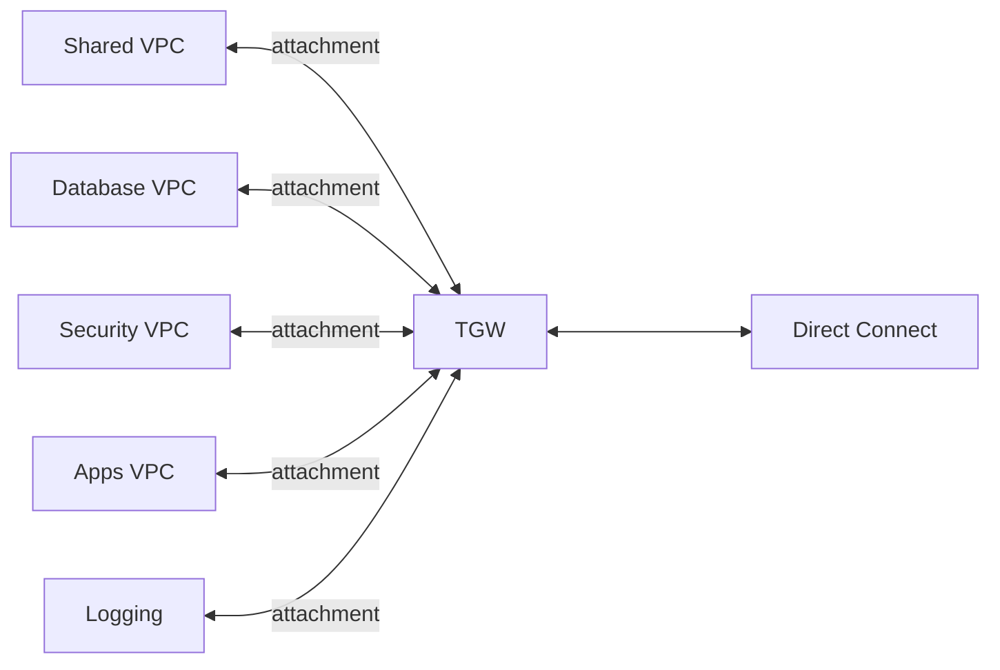
---
layout: two-cols
---

# Private Link / VPC Endpoints

* Establishes private connectivity between VPC and AWS services
* Not all services are supported
* Offers considerable cost savings
* Private link set up using VPC Endpoint
* Private Link is priced per endpoint per hour and data processing fees.

::right::

--- 

# Packet flow (egress)

Over Public Subnet

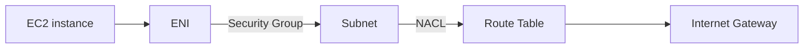

Over Private Subnet

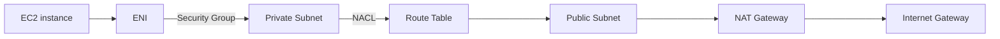
Over Peered VPC Subnet

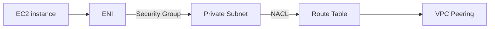
---

# Packet flow (ingress)

Over Public Subnet

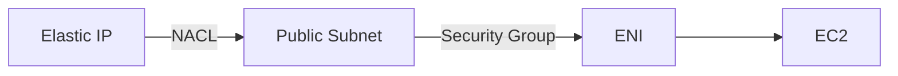

Over Private Subnet, via Load Balancer

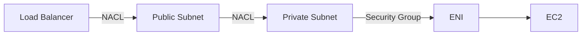
---

# Route 53 resolver 

* aka "Amazon DNS Server", "AmazonProvidedDNS"
* DNS resolver service in each AZ
* Located at 169.254.169.253 / VPC +2 address
* What is the +2 address?

---

# Route 53 resolver 

* What is the +2 address?
  * Assume CIDR of 10.0.0.0/16
  * AWS reserves first four and last IP
  * 10.0.0.0 (network address)
  * 10.0.0.1 (VPC Router)
  * 10.0.0.2 (DNS server)
  * 10.0.0.3 (future use)
  * 10.0.0.255 (broadcast - not supported)

---

# Route 53 resolver 

* Answers DNS queries 
  * local resources (ex EC2 instances)
  * records in private hosted zones
  * public domain look ups
* Outbound resolver 
  * DNS queries *from* VPC to onprem/other VPC
* Inbound resolver 
  * DNS queries *to* VPC from onprem/other VPC

---

# Route 53 resolver packet flows

Outbound resolver packer flow

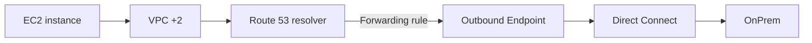

Inbound resolver packer flow

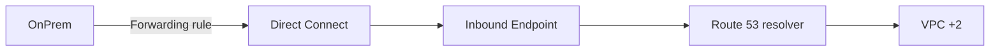